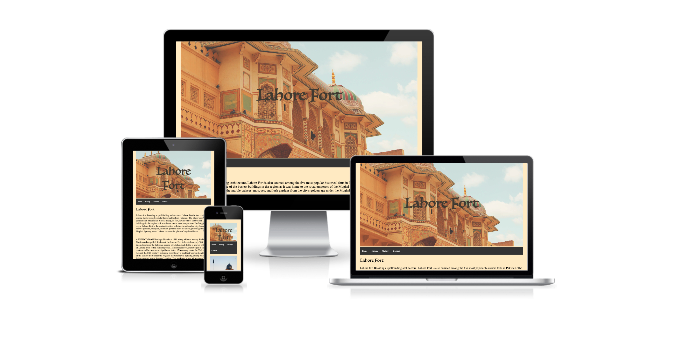
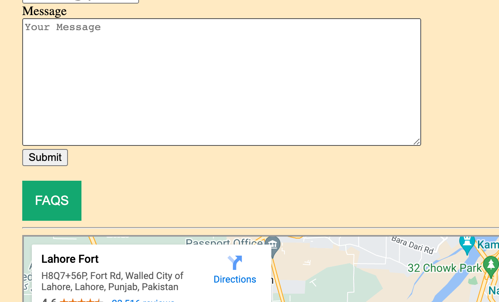
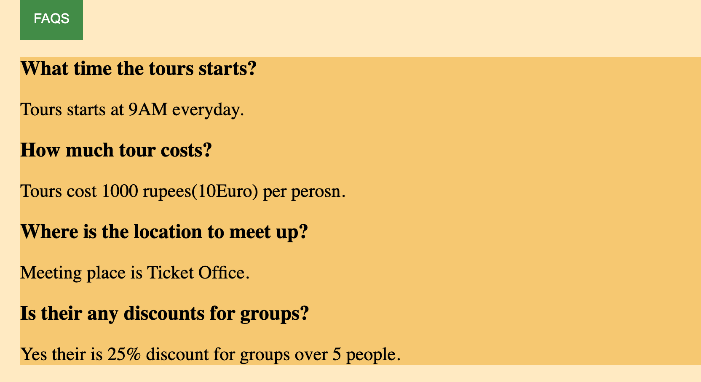
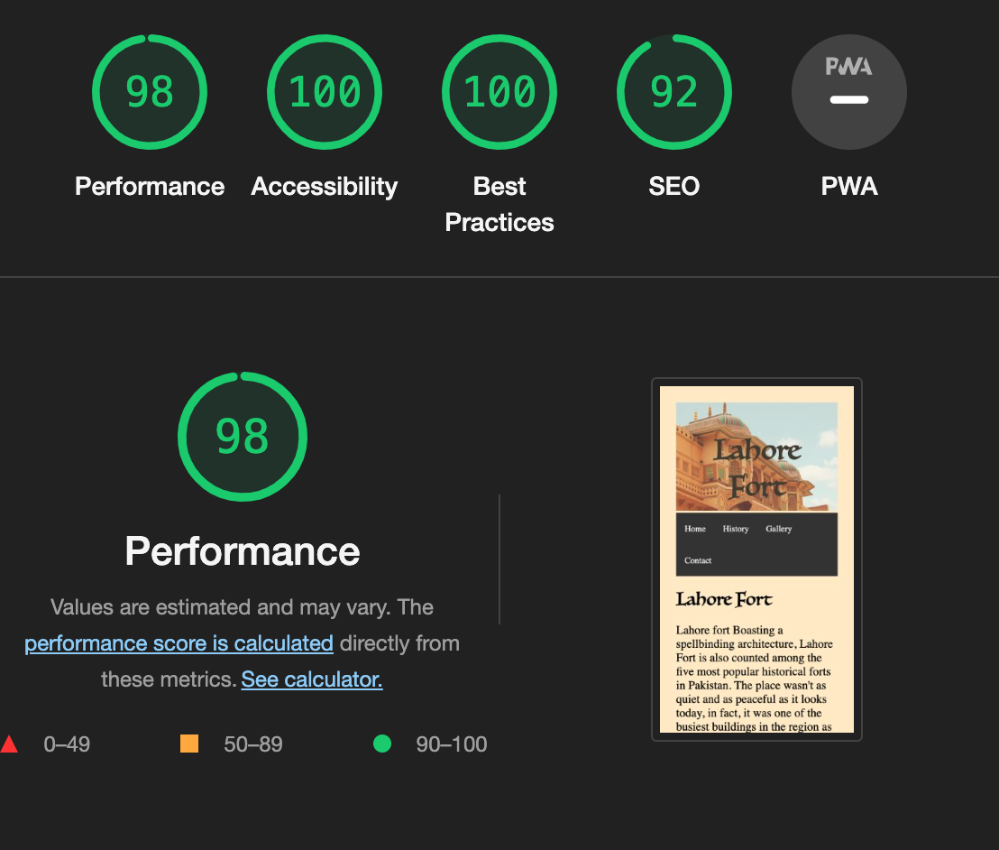

# Lahore-fort
 Lahore Fort is the famous historic Fort in Pakistan.The purpose of the website on Lahore Fort is to showcase the rich cultural heritage and historical significance of the fort, and to promote tourism in Lahore, Pakistan. The website aims to provide comprehensive information on the fort, including its history, architecture, and notable attractions, to attract and engage potential visitors, and to inspire them to visit and experience the unique charm of Lahore Fort. dating back 1000BC.It is one of UNESCO world heritage site.
 

# Features
The main features of this website is, it tell the evolution of Lahore fort in very easy to understand table
The other features includes when you hover over the FAQS button
  
  the dropdown questions and answers appears about Lahore Fort tours
  

# Testing

I tested that this website works in different browsers Chrome,Safari and Firefox.
I confirmed the website is responsive and looks good on all screens.The Site is responsive to all devices.
I confirm that the navigation bar works propely and their is no broken links.
I confirmed that the form and submit button works properly

## Validating
### HTML
no errors were returned when passing through the official W3C validator.
### CSS
no errors were returned when passing through the official W3C validator.
### ACCESSIBILITY

## Unfixed Bugs
I cant figure out how to attach navigation bar with the image above.
### Credits
### CONTENT
https://tourism.punjab.gov.pk/
### IMAGES
https://unsplash.com/
