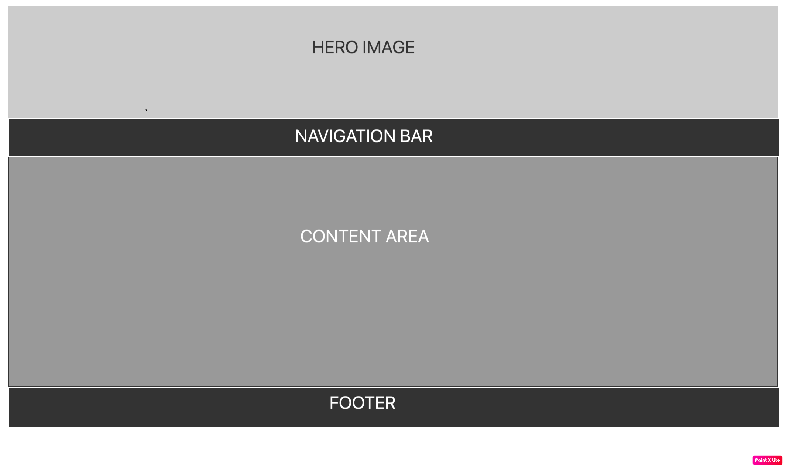

# Lahore-fort
 Lahore Fort is the famous historic Fort in Pakistan.The purpose of the website on Lahore Fort is to showcase the rich cultural heritage and historical significance of the fort, and to promote tourism in Lahore, Pakistan. The website aims to provide comprehensive information on the fort, including its history, architecture, and notable attractions, to attract and engage potential visitors, and to inspire them to visit and experience the unique charm of Lahore Fort. dating back 1000BC.It is one of UNESCO world heritage site.
 

# Wireframe for the site

# Features
The main features of this website is, it tell the evolution of Lahore fort in very easy to understand table
The other features includes when you hover over the FAQS button
  
  the dropdown questions and answers appears about Lahore Fort tours
  

# Color Scheme 
The color scheme used in the webiste is mainly composed of shades of brown and white, with some black and green elements. The background-color for the body is a light yellowish-brown (rgba(254, 229, 170, 0.737)), while the background-color for the header and footer is black (#333). The font-color used for the header is black, while the font-color for the footer is white. The font-color used for the text in general is black, except for the links in the navigation bar, which are white. The color for the hover effect on the links in the navigation bar is a darker shade of black (#111), while the color for the button in the FAQ section is a greenish color (#04AA6D) and the color for its hover effect is a darker green (#3e8e41). The background-color for the answer section in the FAQ is a light yellowish-brown (rgba(243, 201, 103, 0.955)).

# Testing

I tested that this website works in different browsers Chrome,Safari and Firefox.
I confirmed the website is responsive and looks good on all screens.The Site is responsive to all devices.
I confirm that the navigation bar works propely and their is no broken links.
I confirmed that the form and submit button works properly

## Validating
### HTML
no errors were returned when passing through the official W3C validator.
### CSS
no errors were returned when passing through the official W3C validator.
### ACCESSIBILITY

## Fixed bugs
1.fixed Warped Stretched images below 670px

2.fixed form validation and action on form

3.write comments where they were missing.

## Technology Used
HTML5
CSS3

## Unfixed Bugs
I cant figure out how to attach navigation bar with the image above.
### Credits
code institute for formdump page 
youtube tutorials
### CONTENT
https://tourism.punjab.gov.pk/
### IMAGES
https://unsplash.com/
